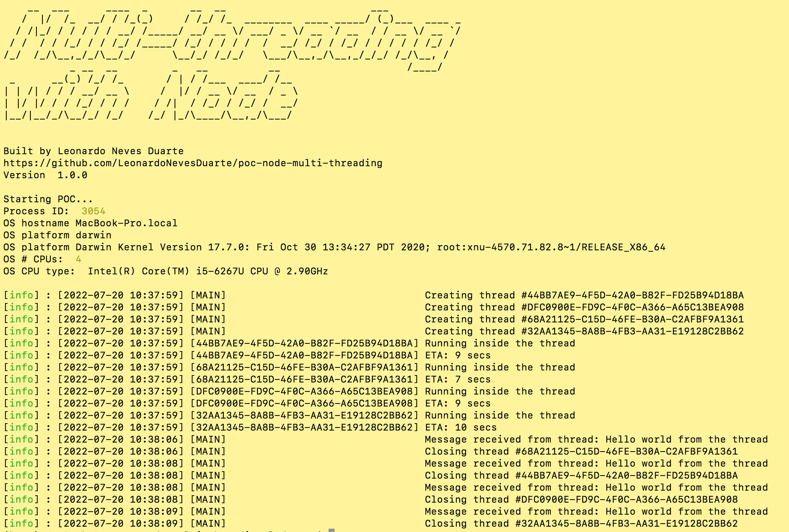

# poc-node-multi-threading
* This is a simple Node.js POC (Proof of concept) showing how to execute tasks in multiple threads

## Index
* [General Information](#general-information)
* [Dependencies](#dependencies)
* [Setup](#setup)
* [Running the POC](#running-the-poc)

## General Information
* This POC was built on Node.js com
* The worker_threads native module is used
* Logs being generated by winston

## Dependencies
* Node modules:
  * figlet
  * moment
  * uuid
  * winston

## Setup
* Clone the repo by running ```git clone https://github.com/LeonardoNevesDuarte/poc-node-multi-threading```
* Install dependencies by running ```npm install```

## Running the POC
* Execute the POC by running the command at the app root folder ```rpm run start```

